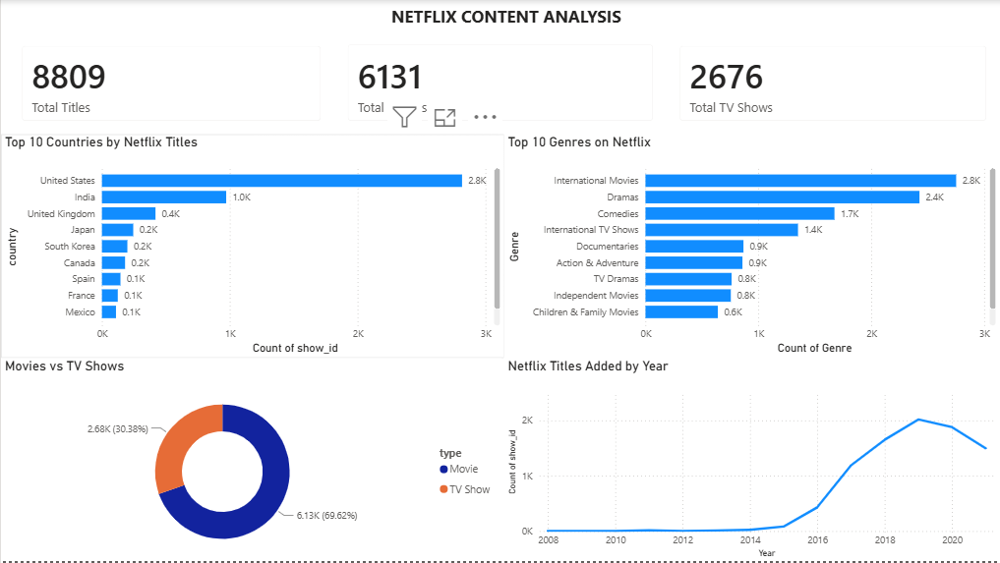
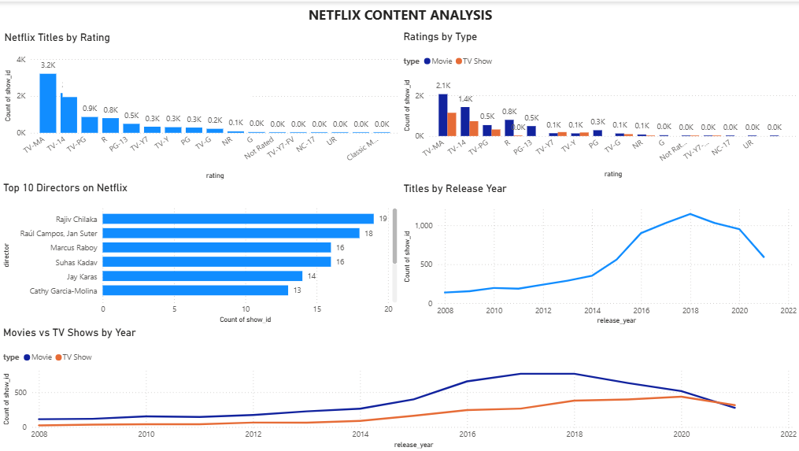

# Netflix Data Analysis Dashboard

## 📊 Project Overview

This project analyzes Netflix movies and TV shows using Microsoft Power BI.

The dashboard provides insights into Netflix's content library, including the distribution of movies and TV shows, popular countries, genres, ratings, directors, and content trends over the years.

The project focuses on transforming raw Netflix data into an interactive and easy-to-understand dashboard.

---

## 🎯 Objectives

The main objectives of this project are:

- Analyze the total number of Netflix titles.
- Compare Movies and TV Shows.
- Identify the countries with the most Netflix titles.
- Identify the most common Netflix genres.
- Analyze Netflix titles by rating.
- Identify directors with the highest number of titles.
- Analyze Netflix content trends over the years.
- Compare Movies and TV Shows released over time.
- Present the findings through an interactive Power BI dashboard.

---

## 🛠️ Tools & Technologies

- Google Sheets — Data cleaning and preparation
- Python — Data analysis and exploration
- PostgreSQL — Database management
- SQL — Data querying and analysis
- Microsoft Power BI — Dashboard development and visualization
- Power Query — Data transformation
- DAX — Calculations and measures

---

## 📁 Dataset

The project uses a Netflix titles dataset containing information such as:

- Show ID
- Type
- Title
- Director
- Cast
- Country
- Date Added
- Release Year
- Rating
- Duration
- Listed In
- Description

The dataset was cleaned and transformed using Power Query before creating the dashboard.

---

## 🧹 Data Cleaning & Transformation

The following data preparation steps were performed:

- Removed unnecessary columns.
- Cleaned text fields.
- Handled missing and blank values.
- Standardized column data types.
- Split multi-value fields where required.
- Transformed the `listed_in` column to create a separate genre analysis table.
- Created measures using DAX.
- Prepared the data for visualization in Power BI.

---

## 📈 Dashboard 1 — Netflix Content Analysis

The first dashboard provides an overview of Netflix's content library.

### Key Metrics

- **Total Titles:** 8,809
- **Total Movies:** 6,131
- **Total TV Shows:** 2,676

### Visualizations

- Top 10 Countries by Netflix Titles
- Top 10 Genres on Netflix
- Movies vs TV Shows
- Netflix Titles Added by Year

---

## 📊 Dashboard 2 — Content Analysis

The second dashboard provides a deeper analysis of Netflix content.

### Visualizations

- Netflix Titles by Rating
- Ratings by Type
- Top 10 Directors on Netflix
- Titles by Release Year
- Movies vs TV Shows by Year

---

## 🔍 Key Insights

Some important observations from the analysis include:

- Movies make up the majority of Netflix's content library.
- The United States has the highest number of Netflix titles in the dataset.
- International Movies and Dramas are among the most common genres.
- TV-MA and TV-14 are among the most frequently occurring ratings.
- Netflix content grew significantly during the late 2010s.
- The number of Netflix titles increased rapidly after 2015.
- Movies consistently represent a larger portion of the Netflix catalog than TV Shows.

---

## 📸 Dashboard Preview

### Netflix Content Analysis

### Content Analysis

---

## 💡 Skills Demonstrated

This project demonstrates practical skills in:

## 💡 Skills Demonstrated

- Data Cleaning
- Exploratory Data Analysis
- Python
- SQL
- PostgreSQL
- Google Sheets
- Power Query
- DAX
- Power BI
- Data Visualization
- Dashboard Design
- Data Storytelling

---

## 🚀 Conclusion

This project demonstrates how raw Netflix data can be transformed into meaningful business insights using Power BI.

The dashboards provide a clear view of Netflix's content distribution, trends, ratings, genres, countries, and other important characteristics of the platform's catalog.
